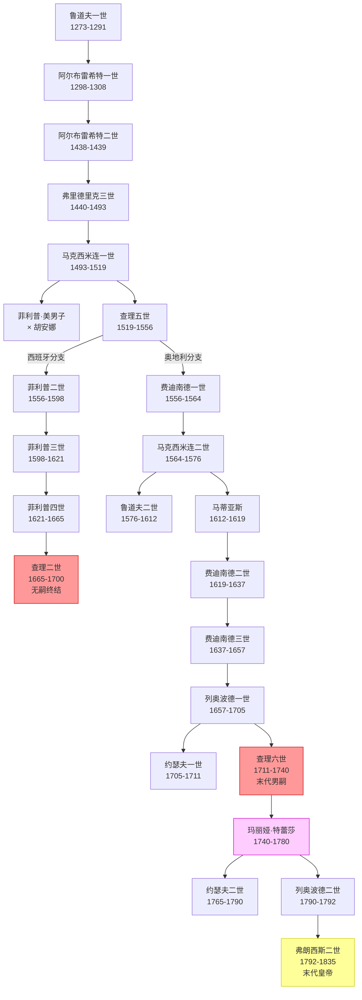

# 哈布斯堡家族世系表

> 本书涉及的哈布斯堡家族主要成员。按世系排列。

## 世系图

## 瑞士起源

- **拉德博特**（Radbot）——哈布斯堡城堡建造者，家族始祖

## 德意志国王与皇帝

### 早期

| 人物 | 在位 | 备注 |
|------|------|------|
| [鲁道夫一世](People.md) | 1273-1291 | 首位哈布斯堡德意志国王，击败奥托卡二世获得奥地利 |
| [阿尔布雷希特一世](People.md) | 1298-1308 | 鲁道夫一世之子，被暗杀 |
| 阿尔布雷希特二世 | 1438-1439 | 首位兼领匈牙利和波西米亚的哈布斯堡国王 |
| [弗里德里克三世](People.md) | 1440-1493 | 最后一位在罗马加冕的皇帝，创造"A.E.I.O.U."格言 |

### 联姻帝国时期

| 人物 | 在位 | 备注 |
|------|------|------|
| [马克西米连一世](People.md) | 1493-1519 | 联姻政策推动者，王朝奠基人 |
| [查理五世](People.md) | 1519-1556 | 哈布斯堡帝国鼎盛时期，退位后家族分裂 |

## 奥地利分支（1556年后）

| 人物 | 在位 | 备注 |
|------|------|------|
| [费迪南德一世](People.md) | 1556-1564 | 奥地利哈布斯堡创始人 |
| [马克西米连二世](People.md) | 1564-1576 | 宽容的天主教徒 |
| [鲁道夫二世](People.md) | 1576-1612 | 迁都布拉格，科学爱好者 |
| [马蒂亚斯](People.md) | 1612-1619 | 迁都回维也纳 |
| [费迪南德二世](People.md) | 1619-1637 | 反宗教改革推动者 |
| [费迪南德三世](People.md) | 1637-1657 | 三十年战争末期 |
| [列奥波德一世](People.md) | 1657-1705 | 维也纳解围，征服匈牙利 |
| [约瑟夫一世](People.md) | 1705-1711 | 西班牙王位继承战争 |
| [查理六世](People.md) | 1711-1740 | 末代男性统治者，颁布《国事诏书》 |
| [玛丽娅·特蕾莎](People.md) | 1740-1780 | 哈布斯堡唯一女性统治者 |
| [弗朗西斯一世](People.md) | 1745-1765 | 玛丽娅之夫，神圣罗马帝国皇帝 |
| [约瑟夫二世](People.md) | 1765-1790 | "理性之子"，开明专制君主 |
| [列奥波德二世](People.md) | 1790-1792 | 托斯卡纳开明公爵 |
| [弗朗西斯二世](People.md) | 1792-1835 | 末代神圣罗马帝国皇帝，首任奥地利皇帝 |

## 西班牙分支（1556-1700）

| 人物 | 在位 | 备注 |
|------|------|------|
| 菲利普二世 | 1556-1598 | 查理五世之子 |
| 菲利普三世 | 1598-1621 | |
| [菲利普四世](People.md) | 1621-1665 | |
| 查理二世 | 1665-1700 | 无嗣，西班牙支系终结 |
| [菲利普五世](People.md) | 1700-1746 | 波旁王朝，安茹公爵 |

## 重要联姻

- **马克西米连一世 × 玛丽（勃艮第）**（1477）——获得尼德兰和勃艮第
- **菲利普"美男子" × 胡安娜（西班牙）**（1496）——开启西班牙支系
- **费迪南德一世 × 安妮（亚盖隆）**（1521）——获得匈牙利和波西米亚宣称权
- **玛丽·路易丝 × 拿破仑**（1810）——政治联姻

## 家族格言

- **A.E.I.O.U.**（Austriae Est Imperare Orbi Universo）——"世界属于奥地利"
- **Bella gerunt alii, tu, felix Austria, nubes!**——"让别人去打仗吧，快乐的奥地利人，结婚吧！"

---

← 返回：[首页](Home.md)
