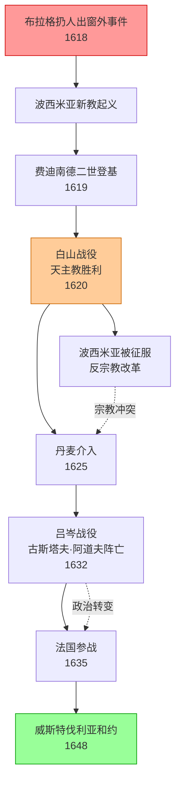
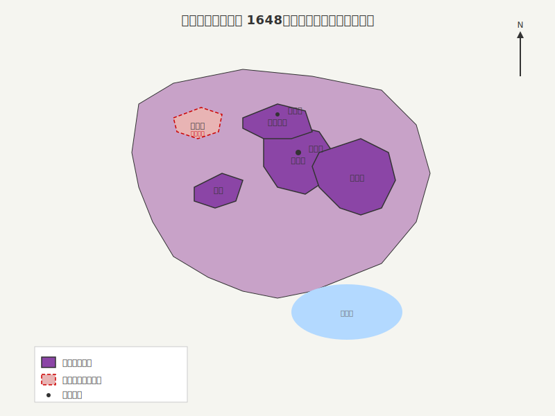

三十年战争 1618-1648
[波西米亚](../Places.md)起义

### 战争因果关系图

### 1648年哈布斯堡疆域（威斯特伐利亚和约后）

{ width="600" title="1648年哈布斯堡帝国疆域图" }

   欧洲历史上有很多大的战争，起因往往是由一些不起眼的地方冲突，然后如同野火一
般，吞没一个又一个国家。每一个参战的成员都有自己的目的，所以战争的性质也会随
之改变。有时战火烧到自己脚下，而最初的交战国可能已经消失，最初的问题可能早已
被遗忘。三十年战争就是一个很好的例子。它始于波西米亚的一个默默无闻的小事件，
之后引发了整个欧洲天主教和**[新教](../Glossary.md)**之间的较量，最终又转变为[哈布斯堡](../Places.md)和[法国](../Places.md)之间的政
治冲突。
   [布拉格](../Places.md)扔人出窗外事件后，波西米亚的新教特权阶层选出了三十位管理者，共同掌管
这个国家的政府。他们再度创建了新教军队，并交由图尔恩伯爵指挥。[西里西亚](../Places.md)和[卢萨蒂亚](../Places.md)也参与其中，为军队提供兵源。此外还有来自德国的新教联盟也派出军队，在
恩斯特·冯·曼斯费尔德（Ernst von
Mansfeld）伯爵的带领下援助波西米亚。这些新的管理者不能容忍天主教，他们驱逐了
境内的**[耶稣会](../Glossary.md)**势力。布拉格大主教和其他主教，以及一些信奉天主教的贵族纷纷逃离了
波西米亚。此时整个国内似乎仅剩下新教势力了，但随后的战争证明他们的胜利只是暂
时的。
   这些新教管理者的行为已经构成了一场真正意义上的革命，虽然他们也属于贵族阶层
。不同于两个世纪前的胡斯运动，1618年波西米亚新教徒的反抗没有掺杂任何民族或社
会因素。这是一场来自特权阶层的反抗，不论是在捷克还是整个德意志，他们通过起义
来维护宗教自由和法理特权。他们并没有尝试争取农民阶层的支持，所以农民在整个冲
突中相当被动。不像胡斯战争，捷克语国家[摩拉维亚](../Places.md)表现得犹豫不决，而德语国家西里
西亚和卢萨蒂亚却热情地给予波西米亚援助。
[费迪南德二世](../People.md)
   波西米亚起义的消息震惊了[维也纳](../Places.md)，老皇帝马蒂亚斯对此束手无策。他的御前顾问，
维也纳的大主教，红衣主教梅尔基奥尔·克里斯留（Melchior
Khlesl）提议以奥地利**[反宗教改革](../Glossary.md)**领袖的身份出面调解。另一方面，马蒂亚斯的假定继
承人费迪南德建议军事镇压。不过在最终做出决定之前，马蒂亚斯在1619年3月20日去世
，费迪南德继承了他的位置。
   费迪南德二世（1619-
1637）并没有过人的天赋，但他是一个有着坚定的信念和性格的人。他曾经在[巴伐利亚](../Places.md)
著名的英戈尔施塔特学院介绍耶稣会士们的教导，所以对于天主教他甘愿为之献身，并
自认为是上帝旨意的传递者。这一点很像他的叔叔，西班牙的菲利普二世。他将新教运
动视为叛乱，二十岁时便显露出强硬的一面。1590年，他继承了内奥地利的爵位，当时
领地内每个省份都有新教徒。而三十年后他成为哈布斯堡的一家之主时，内奥地利的新
教几乎绝迹。在此期间，他关闭新教教堂，驱逐新教牧师，强迫新教贵族和市民要么改
变信仰要么被没收财产移居国外。农民则没有选择的权力，他们被强制改信天主教。在
继承了马蒂亚斯的头衔之后，他将这一政策推广至哈布斯堡的所有领地。
   听闻波西米亚人起义的消息，许多信奉新教的奥地利特权阶层也试图加入他们。局势
已然十分紧张。凭借着过人的勇气和魄力，费迪南德仅动员了少量的军队，就吓住了这
些奥地利特权阶层。1619年6月，当图尔恩领导的波西米亚军队兵临维也纳城下时，他们
不敢加入叛军的队伍，这使得图尔恩不得不打道回府。此外，他还凭借着坚定的性格成
功的分裂了德意志的新教诸侯。[萨克森](../Places.md)的**[选帝侯](../Glossary.md)**，原本是**[路德教](../Glossary.md)**的信徒，此时已经和新
教划清了界限。同年8月，费迪南德当选德意志皇帝。同时，波西米亚宣布废除他的王位
，并选举当地的选帝侯帕拉丁·弗里德里克，这位新教联盟的领导人和英格兰国王詹姆士
一世的女婿作为波西米亚的新国王。
波西米亚独立的尾声
   波西米亚的特权阶层选举弗里德里克一世（1619-
1620）作为国王，本打算借此得到德意志和英格兰新教势力的支持。然而事实证明，他
们选错了人。弗里德里克虽然在政治上有些天赋，但却不是一个合格的军事家。作为一
个加尔文信徒，他疏远了德国和波西米亚的路德派，来自德意志新教势力的援助因此大
打折扣。而英格兰几乎一点动作也没有，波西米亚的盟友只有[特兰西瓦尼亚](../Places.md)的国王[加布里埃尔·百瑟伦](../People.md)。费迪南德二世（书中为“一世”，有误——译者注）方面，他获得了西班牙
的堂弟菲利普三世和天主教联盟的领袖，巴伐利亚的马克西米连的帮助。
   1619年9月，百瑟伦和图尔恩再度包围了维也纳，但由于天气转冷，物资缺乏，恰巧
特兰西瓦尼亚又起战事⑧，迫使他们从帝国首都撤了出去。1620年，男爵蒂利（Jan
Tserklaes）带领下的天主教联盟军队和卡尔·柏卡依（Karl
Bouquoy）指挥的帝国军队在[奥地利](../Places.md)会师。新教特权阶层的气焰才有所收敛。
   之后，奥地利的天主教军队开始了对波西米亚的入侵，矛头直指布拉格。1620年9月
8日，波西米亚军队，包括一些因佣金过低而心怀不满的雇佣军，以及唯一的盟友特兰西
瓦尼亚军队在布拉格白山（the White
Mountain）附近的高地平原与奥地利军队开战。之后的战役中，他们被彻底地击溃。收
到战败的消息之后，弗里德里克（被称为“冬王Winter
King”）惊慌失措，赶忙逃往西里西亚。布拉格此时已放弃了抵抗，波西米亚的起义被镇
压了。
   白山战役相比较胡斯战争，只能算是一场小规模的遭遇战，但却决定了波西米亚几个
世纪的命运。战后，帝国的专员，诸侯卡尔·列支敦士登（Karl
Liechtenstein）和红衣主教弗朗茨·迪特里希施泰因（Franz
Dietrichstein）迅速采取行动，巩固了费迪南德取得的战果。没能逃往国外的叛军头目
全部被逮捕，1621年45人被处以死刑，其中21人在布拉格老城区的广场上被执行。所有
叛军分子（总共680人）的财产被没收。《与陛下书》不再被执行，波西米亚的新教徒也将
面临和奥地利新教一样的命运。摩拉维亚的新教受到的惩罚相对较轻。西里西亚和卢萨
蒂亚则完全地躲过一劫，但根据与费迪南德的协议，他们的土地被萨克森选帝侯的军队
占领。虽然直到1627年对波西米亚的主权政体改革才被执行，捷克人还是将白山战役视
为波西米亚独立运动的终点。
   在这期间，匈牙利的新教并没有受到太大影响。就目前来看，他们还没有陷入和奥地
利和波西米亚一样的窘境。费迪南德专注于德国的事务，无暇顾及他们。1621年，费迪
南德和百瑟伦在米库洛夫（Nikolsburg）议和。根据条款百瑟伦放弃匈牙利的王位，费
迪南德则承认他为特兰西瓦尼亚公国的国王。对于境内的新教势力，哈布斯堡在《米库洛
夫条约》中继续执行1606年和博奇考伊签订的《维也纳条约》里的相关条目。
战争的蔓延
   波西米亚起义被镇压以及同百瑟伦的议和并没能为冲突画上休止符，战火此时已经蔓
延到了德国境内。1620年，西班牙军队将[尼德兰](../Places.md)人赶出了普法尔茨。这片原属于弗里德
里克的领地被没收，他的选帝侯资格被巴伐利亚的马克西米连剥夺。新教联盟被解散，
但就在费迪南德和他的盟友忙于清剿波西米亚的新教之时，新的势力出现了。1622年，
西班牙从[米兰](../Places.md)手里获得了瓦尔泰利纳（Valtelline），并打通了和奥地利哈布斯堡领地
的陆上通道。为了遏制哈布斯堡的势力，法国向西班牙宣战。1624年，当费迪南德和马
克西米连几乎就要消灭德国北部的新教势力时，丹麦国王克里斯蒂安四世（Christian
IV）以拯救新教为由，趁机派兵介入。
   在这紧要关头，费迪南德发现了一位可以委以重任的人——[阿尔布雷希特·华伦斯坦](../People.md)（
Albrecht of Wallenstein,1583-
1634），这是一个出生在新教家庭但却皈依天主教的波西米亚贵族。1624年，他被任命
为弗里德兰（Friedland）的公爵并被委派组建军队。华伦斯坦从欧洲各地招募雇佣军，
并允许他们对占领的地区进行掠夺。如同土耳其人劫掠匈牙利一般，这支军队开始在波
西米亚和德国的土地上横行霸道。
   到了1629年，华伦斯坦和蒂利已经征服了德国北部大部分地区和丹麦大陆上的领土。
克里斯蒂安四世逃往丹麦的附属岛屿，并匆忙缔结了和平条约退出战斗。战胜了新教诸
侯并在国内实行君主专制的费迪南德似乎已经胜券在握。1629年3月29日，为了巩固第一
阶段的战果，他颁布了著名的《归还教产敕令》（Edict of
Restitution）。这份敕令规定了，自1555年《奥格斯堡条约》签订以来，所有世俗化的原
宗教土地将被归还天主教，在国内仅允许路德教（不包括**[加尔文教](../Glossary.md)**）享有宗教自由。华
伦斯坦试图劝阻，但由于激怒了天主教而被碰了一鼻子灰，并因此遭到驱逐。
瑞典和法国的干预
   华伦斯坦对德国北部的征服，震惊了信奉新教的瑞典国王古斯塔夫·阿道夫（Gustav
us II Adolphus,1594-
1632）。他曾经起誓要征服[波罗的海](../Places.md)南部沿岸的俄国和[波兰](../Places.md)领地，将其变成瑞典的一个
“湖”。哈布斯堡即将到手的胜利，还惊动了负责法国事务的红衣大主教黎塞留（Richel
ieu,1585-
1642）。为此，他改变了法国的外交策略，鼓动古斯塔夫结束了与波兰的战争（阿尔特
马克休战，1629），对德国进行干涉。1630年瑞典军队进入德国境内，并沿着多瑙河和
[莱茵河](../Places.md)向前推进。而萨克森的选帝侯借机与瑞典人结盟，占领了波西米亚。费迪南德被
迫再度命令华伦斯坦出兵。1632年，古斯塔夫在吕岑之战中大败华伦斯坦，但他本人却
在死在了战场上。他的首相，阿克塞尔·乌克森谢纳（Axel Oxenstjerna ,1583-
1654）辅佐未成年的女王克里斯蒂娜（Christina,1632-
1654）继续推行他生前的政策，但他的去世使瑞典失去了新教联军领袖位置。僵局还在
持续，高深莫测的华伦斯坦开始私下里与法国、瑞典和德意志的新教诸侯进行谈判。他
的这种叛逆行为，最终传到了维也纳的宫廷里。1634年，华伦斯坦又一次被费迪南德驱
逐。最终，在他想逃向敌军阵营时⑨，被手下的一位爱尔兰军官暗杀。
   在1635年《布拉格条约》中，萨克森选帝侯割让了卢萨蒂亚，以重新换回费迪南德的信
任。为此，黎塞留决定直接干预，扶持德国境内的新教活动。两年后，费迪南德二世去
世，德意志的宗教和政治冲突依然没有停歇。他的儿子，皇帝[费迪南德三世](../People.md)（1637-
1657）急于结束战争，反而使德国和他自己的领地成为一片焦土。
**[威斯特伐利亚和约](../Glossary.md)**
   早在1641年，费迪南德三世就开始与德意志的新教诸侯进行谈判。1643年，他与瑞典
议和，1644年又不顾西班牙的反对和法国议和。黎塞留在1642年去世，但他的政策在他
的助手兼继任者，红衣主教[马萨林](../People.md)（1602-
1661）手中继续执行。这场在明斯特（Münster）和奥斯纳布吕克（Osnabrück）进行的
和平谈判，因为牵扯到大量的参战国和错综复杂的问题，被拖了七年之久。尽管费迪南
德强烈反对，马萨林还是允许德意志的诸侯，甚至是特兰西瓦尼亚国王参与这场和平谈
判。1648年一系列条约被签署通过，统称为《威斯特伐利亚条约》，这场可怕的三十年战
争宣告结束。
   《威斯特伐利亚条约》其实是法国政策上的一场大胜利。德意志的众诸侯因此获得了主
权（Landeshoheit），而作为签约国之一的法国，则名正言顺地成为他们主权的保证者
。德意志开始分裂，并从此一蹶不振。条约还使得瑞士邦联和联省共和国（尼德兰）合
法的独立，虽然它们很早就已经这么认为，但这次获得了国际的认可。
   德国的宗教问题，始终是一个亟待解决的复杂问题。《威斯特伐利亚条约》保证了德意
志的天主教和新教（包括加尔文教和路德教）的同等地位和信仰自由。德意志议会中的
天主教徒和新教徒的地位得到了仔细的权衡，并将讨论内容备忘录以天主教文集与福音
派文集并行的形式分别记载。讨论宗教问题时，双方必须坐到自己的位置（(jus
eiundi in
partes），若宗教问题在议会无法做出处理，则交由两个团体共同商议加以解决。这在
议会构成了一个僵局，
   哈布斯堡并没能实现在德国的天主教化和专制统治。他们仅保留了一个受人质疑的神
圣罗马皇帝头衔，直到1806年《威斯特伐利亚条约》失效，这个帝国仅仅以一个鬼魂的状
态存在，而肉体早已不见踪影。

---

← 上一章：[哈布斯堡帝国的形成 1526-1648](../chapters/ch04-formation-of-habsburg-empire.md) | → 下一章：[巩固和扩张 1648-1739](../chapters/ch06-consolidation-and-expansion.md)